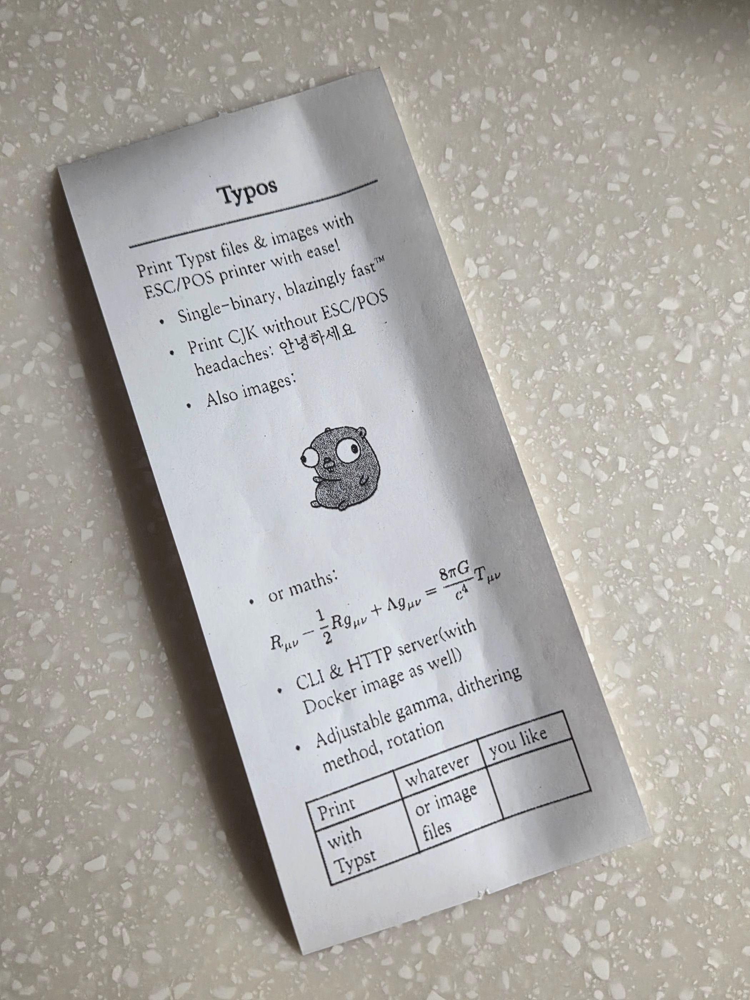

# typos


Typst-to-ESC/POS bridge for thermal printers. CLI and REST server. Linux only.

- Render Typst documents or images to dithered ESC/POS raster
- REST server with async job queue
- Template system (TOML) with multipart file uploads
- Every flag configurable via `TYPOS_*` env vars



## Requirements

- Linux with access to the serial device (e.g. `dialout` group membership)
- [`typst`](https://github.com/typst/typst) binary on `PATH` for document rendering (already included in the Docker image)

## Build from source

```bash
go build -o bin/typos ./cmd/typos                # CLI
go build -o bin/typos-server ./cmd/typos-server  # server
# or: just build / just build server
```

## CLI

Pre-built binaries are available on the [releases page](https://github.com/shlewislee/typos/releases).

```bash
./typos print receipt.typ --device /dev/ttyUSB0 --width 72 --input "name=Lewis" --input "order=1234"
./typos image photo.jpg --rotate --gamma 1.95 --dither-method 1
./typos status --device /dev/ttyACM0
```

## Server

```bash
./typos-server serve --device /dev/ttyACM0 --width 72 --templates ./templates.toml --addr 127.0.0.1:8888
```

or you can also use docker compose:

```yaml
services:
  typos:
    image: ghcr.io/shlewislee/typos:latest
    restart: unless-stopped
    devices:
      - /dev/ttyACM0:/dev/ttyACM0
    ports:
      - "8888:8888"
    environment:
      TYPOS_WIDTH: 72
      TYPOS_TEMPLATES: /app/templates/templates.toml
      TYPOS_FONT_PATH: /app/fonts
    volumes:
      - ./templates:/app/templates:ro
      - ./fonts:/app/fonts:ro
```

```bash
docker compose up -d
```

### API

See [`docs/api.md`](docs/api.md). Job responses return `202 {"id": "..."}`, poll `GET /print/jobs/:id`.

```bash
curl http://localhost:8888/health
curl -X POST http://localhost:8888/print/template -F "name=receipt" -F 'inputs={"title":"Hello"}'
curl -X POST http://localhost:8888/print/image -F "file=@photo.png"
```

> **Security:** The server has no authentication and accepts arbitrary file uploads. Bind to localhost or keep it on a trusted network only.

## Configuration

See [`docker/.env.example`](docker/.env.example) for a reference file.

| Flag              | Env                   | Default          |
| ----------------- | --------------------- | ---------------- |
| `--device`        | `TYPOS_DEVICE`        | `/dev/ttyACM0`   |
| `--baudrate`      | `TYPOS_BAUDRATE`      | `9600`           |
| `--width`         | `TYPOS_WIDTH`         | `72`             |
| `--dpi`           | `TYPOS_DPI`           | `203`            |
| `--gamma`         | `TYPOS_GAMMA`         | `4.5`            |
| `--dither-method` | `TYPOS_DITHER_METHOD` | `0` (Atkinson)   |
| `--templates`     | `TYPOS_TEMPLATES`     | —                |
| `--font-path`     | `TYPOS_FONT_PATH`     | —                |
| `--addr`          | `TYPOS_ADDR`          | `127.0.0.1:8888` |
| `--max-jobs`      | `TYPOS_MAX_JOBS`      | `1000`           |
| `--verbose`       | `TYPOS_VERBOSE`       | `false`          |

Dither methods: `0`=Atkinson, `1`=FloydSteinberg, `2`=StevenPigeon.

## Planned

- aarch64 build/docker image
- rudimentary auth for HTTP server

## LLM Disclosure

The core printer logic and CLI were entirely hand-written(and will remain so), while the REST API was largely developed with AI under the author's direction.

<details>
  <summary>Details</summary>

As the presence of `AGENTS.md` suggests, a significant part of this codebase was written by AI via Opencode.

I originally hand-wrote the core printer/Typst logic and the CLI. The REST API wasn't actually in the plan, but after a few days of using the CLI I realized I wanted one. Since I'd already had all the fun I could have with the project, I didn't feel like writing yet another REST API. So I tried something I'd been avoiding: AI tools. I eventually settled on Opencode.

Here is the list of models used for the server implementation (in order of usage):

- Kimi K2.6
- Deepseek Flash V4
- Gemini 3.1 family
- Big Pickle (Opencode)
- Deepseek Pro V4

I didn't particularly enjoy the process, and it definitely took more time than it saved, but I tried my best to keep the code aligned with my standards. All structural and design decisions were made by me.

I've worked to avoid shipping "AI slop," but whether I succeeded depends on your perspective. The underlying printer logic and CLI remain 100% hand-written.

</details>

## License

MPL-2.0. See [`LICENSE.md`](LICENSE.md).
